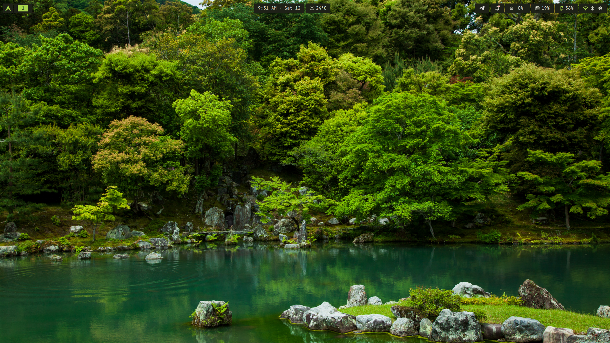
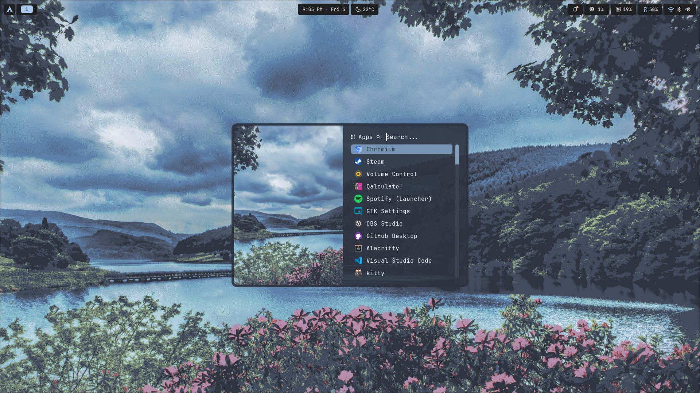
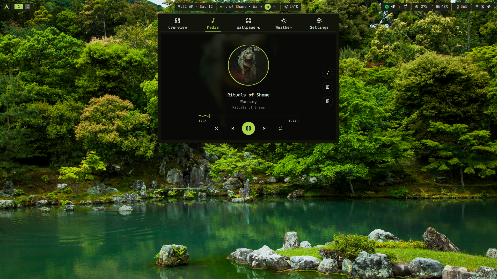
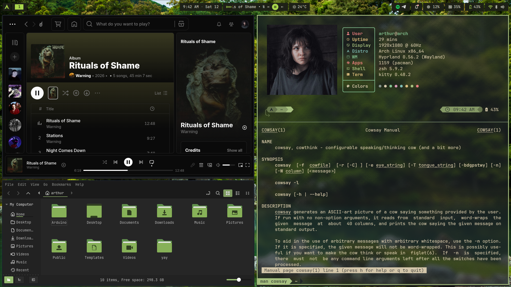
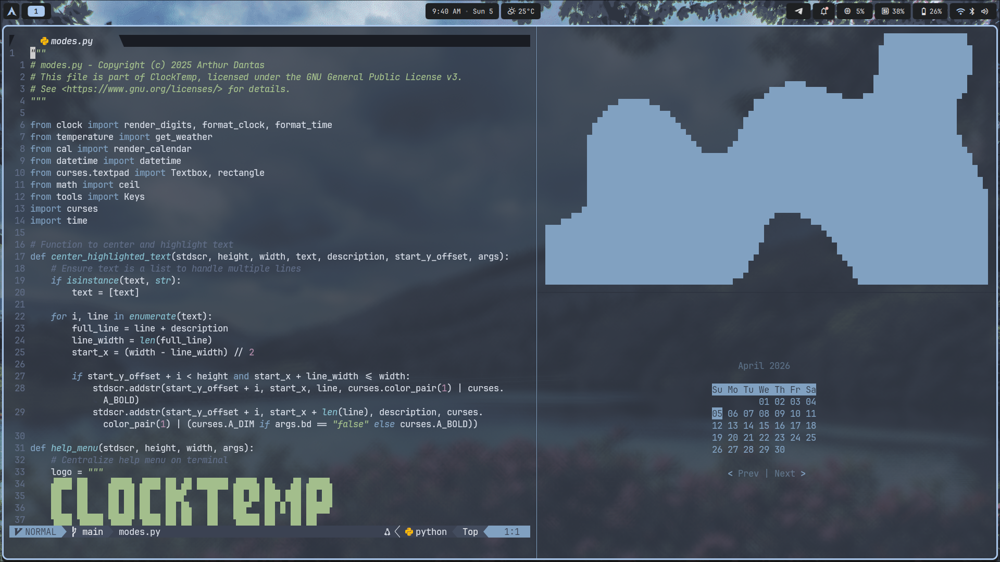
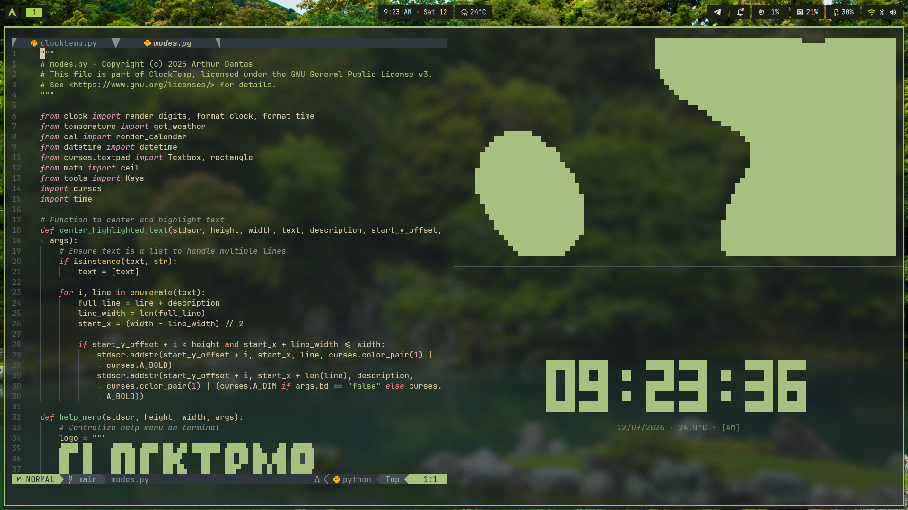

    <h1>Arch Linux Dotfiles</h1>
    
Dotfiles and resources of my Arch Linux setup

    <h1>Showcase</h1>
    <table>
        <tr>
            <td></td>
            <td></td>
        </tr>
        <tr>
            <td></td>
            <td></td>
        </tr>
        <tr>
            <td></td>
            <td></td>
        </tr>
    </table>

    <h1>Theme, Cursor and Fonts</h1>

### Theme and cursor

- [Nordic Darker GTK Theme](https://www.gnome-look.org/p/1267246) (Theme)
- [Papirus White](https://www.gnome-look.org/p/1166289/) (Icons)
- [Ruri Rinka Cursor Pack](https://www.gnome-look.org/p/2332234) (Cursor)

### Fonts

- [Nerd Fonts](https://www.nerdfonts.com/) (For terminal and NeoVim)
- [JetBrains Mono](https://www.jetbrains.com/lp/mono/) (For system-wide)

    <h1>Programs</h1>

- [Dank Material Shell](https://github.com/AvengeMedia/DankMaterialShell) (Custom shell)

- [Nemo](https://github.com/linuxmint/nemo) (File Browser)

- [Kitty](https://github.com/kovidgoyal/kitty) (Terminal)

- [Starship](https://github.com/starship/starship) (Prompt customization)

- [ClockTemp](https://github.com/arthur-dnts/ClockTemp) (Display time, date and temperature)

- [NeoVim](https://github.com/neovim/neovim) (Code editor)

- [Yazi](https://github.com/sxyazi/yazi) (Terminal File Browser)

- [Fastfetch](https://github.com/fastfetch-cli/fastfetch) (Display system information)

- [Btop](https://github.com/aristocratos/btop) (Resource monitor)

- [Cava](https://github.com/karlstav/cava) (Audio visualizer)

- [Rofi](https://github.com/davatorium/rofi) (Programs launcher)

- [qimgv](https://github.com/easymodo/qimgv) (Image Viewer)

- [mpv](https://github.com/mpv-player/mpv) (Video Player)

- [RMPC](https://github.com/mierak/rmpc) (Music Player)

- [Zathura](https://github.com/pwmt/zathura) (Document Reader)

 <h1>License</h1>
 
This project is licensed under the MIT License. See the LICENSE file for details.

